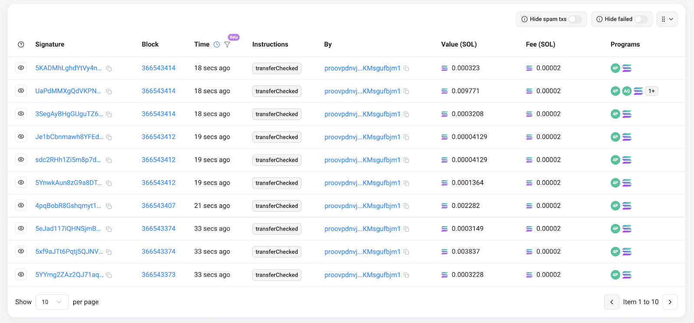
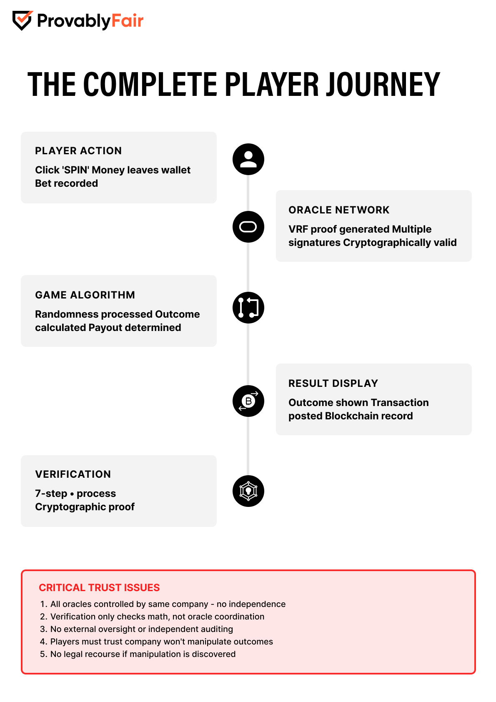

# Evidence

## \[1] Oracle signer transactions list

<figure><figcaption></figcaption></figure>

<figure><figcaption></figcaption></figure>

## \[2] Same signer used across multiple users/games

<figure><figcaption></figcaption></figure>

<figure><figcaption></figcaption></figure>

<figure><figcaption></figcaption></figure>

<figure><figcaption></figcaption></figure>

<figure><figcaption></figcaption></figure>

## \[3] No public instructions to run an oracle node

<figure><figcaption></figcaption></figure>

<figure><figcaption></figcaption></figure>

<figure><figcaption></figcaption></figure>

## \[4] No on-chain commit to bet (no commit–reveal)

<figure><figcaption></figcaption></figure>

## \[5] VRF not bound to block/slot

<figure><figcaption></figcaption></figure>

<figure><figcaption></figcaption></figure>

<figure><figcaption></figcaption></figure>

<figure><figcaption></figcaption></figure>

<figure><figcaption></figcaption></figure>

## \[6] Off-chain oracle generates VRF, only final posted

<figure><figcaption></figcaption></figure>

## \[7] Demonstration of re-roll risk (concept or tool)

<figure><figcaption></figcaption></figure>

## \[8] Timing gap: bet → VRF post

<figure><figcaption></figcaption></figure>

<figure><figcaption></figcaption></figure>

## \[9] No on-chain function to rotate oracle signers

<figure><figcaption></figcaption></figure>

<figure><figcaption></figcaption></figure>

## \[10] Halborn: reliance on off-chain logic

[Halborn Audit PDF](https://proov.network/assets/halborn_audit-BD80swCh.pdf)

<figure><figcaption></figcaption></figure>

***

Game Logic (off-chain black box, unverifiable fairness)

## \[11] Slot/Vault contract extracts show no outcome logic

No Game logic provided:

<figure><figcaption></figcaption></figure>

<figure><figcaption></figcaption></figure>

## \[12] Data flow (RNG → off-chain → payout)

<figure><figcaption></figcaption></figure>

## \[13] No published RTP/odds per game on-chain

<figure><figcaption></figcaption></figure>

<figure><figcaption></figcaption></figure>

<figure><figcaption></figcaption></figure>

<figure><figcaption></figcaption></figure>

<figure><figcaption></figcaption></figure>

## \[14] Backend distributions

<figure><figcaption></figcaption></figure>

## \[15] No user-verifiable reproduction path (no client seed binding)

<figure><figcaption></figcaption></figure> <figure><figcaption></figcaption></figure>

***

Jackpot Case (wallet behavior, probability)

## \[16] Winner wallet page (5or7BF…): full TX history

[https://solscan.io/tx/5s1N4ZfXETh3AgpJfUR57xMkGtetmKQ5UMMtVWxXdQa85XjrFi9m5A8rBZwnk6yQa98Hyd7Ar3xujV687zn8cjSo](https://solscan.io/tx/5s1N4ZfXETh3AgpJfUR57xMkGtetmKQ5UMMtVWxXdQa85XjrFi9m5A8rBZwnk6yQa98Hyd7Ar3xujV687zn8cjSo)

<figure><figcaption></figcaption></figure>

<figure><figcaption></figcaption></figure>

\\

## \[17] Kraken-funded deposits (2× >600 SOL)

<figure><figcaption></figcaption></figure>

<figure><figcaption></figcaption></figure>

## \[18] Micro-tx burst to gambling dApps

<figure><figcaption></figcaption></figure>

<figure><figcaption></figcaption></figure>

<figure><figcaption></figcaption></figure>

<figure><figcaption></figcaption></figure>

## \[19] No DeFi/NFT usage (ephemeral wallet)

<figure><figcaption></figcaption></figure>

<figure><figcaption></figcaption></figure>

<figure><figcaption></figcaption></figure>

<figure><figcaption></figcaption></figure>

<figure><figcaption></figcaption></figure>

## \[20] Timeline: Kraken → play burst → jackpot → withdraw

<figure><figcaption></figcaption></figure>

<figure><figcaption></figcaption></figure>

## \[21] Jackpot payout TX (sender not vault)

<figure><figcaption></figcaption></figure>

<figure><figcaption></figcaption></figure>

## \[22] Probability graph (Poisson) for 2 in 5,000

<figure><figcaption></figcaption></figure>

## \[23] Statement: no jackpot transparency report

<figure><figcaption></figcaption></figure>

<figure><figcaption></figcaption></figure>

<figure><figcaption></figcaption></figure>

\\

***

Payouts, Liquidity, Proof-of-Reserves

## \[24] Vault settlement log (typical small win auto-settled)

\\

<figure><figcaption></figcaption></figure>

<figure><figcaption></figcaption></figure>

## \[25] Cold reserve described (marketing)

<figure><figcaption></figcaption></figure>

## \[26] Cold reserve is a wallet, not a contract

<figure><figcaption></figcaption></figure>

## \[27] Jackpot payout not routed via vault contract

<figure><figcaption></figcaption></figure>

## \[28] No timelock/multisig on reserve

<figure><figcaption></figcaption></figure>

<figure><figcaption></figcaption></figure>

\\

## \[29] No on-chain proof-of-liabilities

<figure><figcaption></figcaption></figure>

<figure><figcaption></figcaption></figure>

***

Admin / Upgradeability / Governance

## \[30] Program marked upgradeable (BPF Loader)

<figure><figcaption></figcaption></figure>

\\

## \[31] Upgrade authority is team-controlled

<figure><figcaption></figcaption></figure>

<figure><figcaption></figcaption></figure>

## \[32] No public DAO governance (no SPL governance links)

<figure><figcaption></figcaption></figure>

## \[33] No pause/override functions publicly exposed

<figure><figcaption></figcaption></figure>

<figure><figcaption></figcaption></figure>

## \[34] Halborn “authority transfer not enforced” fixed

<figure><figcaption></figcaption></figure>

## \[35] Settlement batching acknowledged (delay possible)

<figure><figcaption></figcaption></figure>

<figure><figcaption></figcaption></figure>

* IST to UST Time (At least 2 minutes settlement delay)

<figure><figcaption></figcaption></figure>

***

Halborn Scope / Audit Transparency

## \[36] Halborn scope omits RNG/oracles/game logic

<figure><figcaption></figcaption></figure>

<figure><figcaption></figcaption></figure>

<figure><figcaption></figcaption></figure>

<figure><figcaption></figcaption></figure>

<figure><figcaption></figcaption></figure>

## \[37] No public GitHub/IPFS for audited code

<figure><figcaption></figcaption></figure>

***

Trustless vs Reality (Marketing vs facts)

## \[38] Screenshot of “provably fair for every spin” claim

<figure><figcaption></figcaption></figure>

## \[39] Screenshot of “decentralized oracles” claim

<figure><figcaption></figcaption></figure>

<figure><figcaption></figcaption></figure>

<figure><figcaption></figcaption></figure>

## \[40] Screenshot of “non-custodial, you control funds” claim

<figure><figcaption></figcaption></figure>

## \[41] Claims vs Reality table (final)

<figure><figcaption></figcaption></figure>

***

Player Seed / Verifiability (if they argue seed input)

## \[42] No Client seed input UI

<figure><figcaption></figcaption></figure>

## \[43] No path to reproduce outcome from seed

* No seed input ui \[42]

***

Public Explorer (“we show everything now”) rebuttal

## \[44] Explorer shows logs, not pre-commit proofs

<figure><figcaption></figcaption></figure>

## \[45] Example: bet log with no player-seed binding

* No seed input ui \[42]

***

Minimal test case (dev tool / repro)

## \[46] 3 real bets with full fields (CSV)

* [bets\_sample.csv](https://docs.google.com/spreadsheets/d/1Tt-KgN4EJYt25z7WQNDVP9n6QgXrCNvLmESyZ8ZtGjw/edit?gid=1850635201#gid=1850635201)

## \[47] One bet timeline

<figure><figcaption></figcaption></figure>

***

## \[48] Admin/Reserve safety

<figure><figcaption></figcaption></figure>

## \[49] No multisig on reserve (EOA ownership)

<figure><figcaption></figcaption></figure>

<figure><figcaption></figcaption></figure>

## \[50] Comparision and Architecture upgrades

<figure><figcaption></figcaption></figure>

<figure><figcaption></figcaption></figure>
